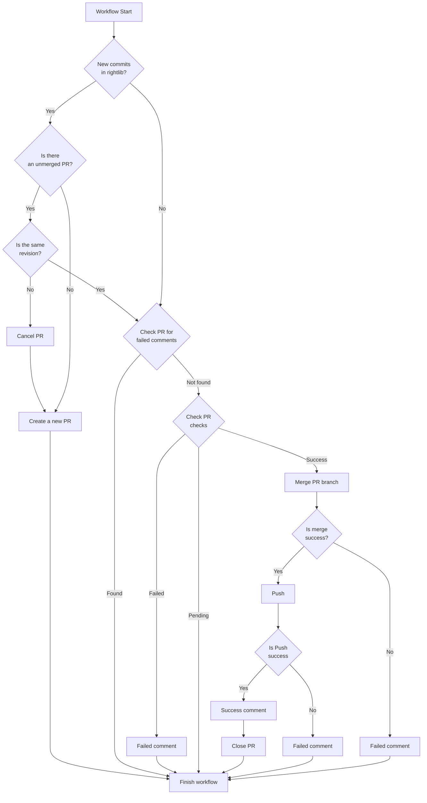

```mermaid
flowchart
W[Workflow Start] --> CommitCheck{New commits<br> in rightlib?}
CommitCheck -->|Yes| CheckExistingPR{Is there<br/>an unmerged PR?}
CheckExistingPR --> |Yes| CheckRevision{Is the same<br/>revision?}
CheckRevision --> |Yes| CheckPRComments
CheckRevision --> |No| CancelPRCheck[Cancel PR] --> CreatePR

CheckExistingPR --> |No| CreatePR[Create a new PR]
CreatePR --> Finish[Finish workflow]

CommitCheck -->|No| CheckPRComments{Check PR for<br/>failed comments}
CheckPRComments --> |Not found| CheckPRChecks{Check PR<br/>checks}
CheckPRComments --> |Found| Finish
CheckPRChecks --> |Failed| PostCheckFailedComment[Failed comment] --> Finish
CheckPRChecks --> |Pending| Finish
CheckPRChecks --> |Success| MergePR[Merge PR branch]
MergePR --> IsMergeSuccess{Is merge<br/>success?}
IsMergeSuccess --> |Yes| Push
Push --> IsPushSuccess{Is Push<br/>success}
IsPushSuccess --> |Yes| SuccessComment[Success comment] --> ClosePR[Close PR] --> Finish
IsPushSuccess --> |No| PushFailedComment[Failed comment] --> Finish
IsMergeSuccess --> |No| FailedComment[Failed comment] --> Finish
```
