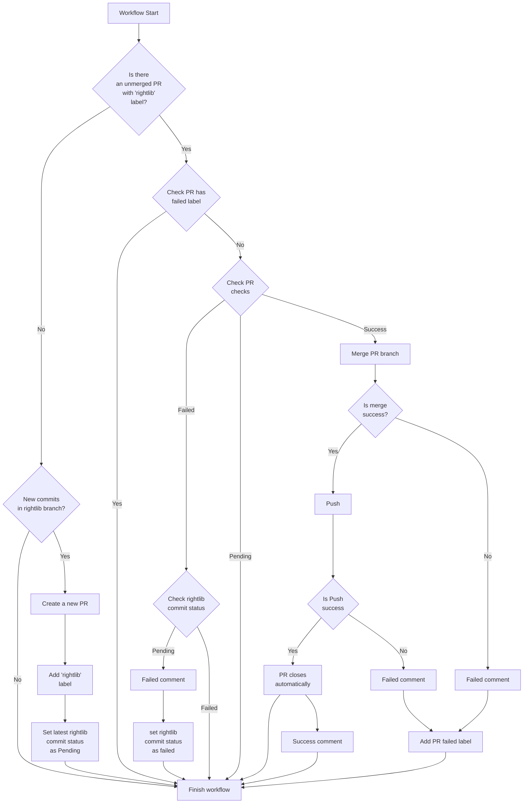

```mermaid
flowchart TB
W[Workflow Start] --> CheckExistingPR{Is there<br/>an unmerged PR<br/>with 'rightlib'<br/>label?}

CheckExistingPR --> |No| RightlibCommitCheck{New commits<br>in rightlib branch?}
    RightlibCommitCheck --> |No| Finish
    RightlibCommitCheck --> |Yes| CreatePR[Create a new PR]
        CreatePR --> AddRightlibLabel[Add 'rightlib'<br/> label]
    AddRightlibLabel --> SetRightlibCommitStatusPending[Set latest rightlib<br/>commit status<br/> as Pending]
            SetRightlibCommitStatusPending --> Finish[Finish workflow]

CheckExistingPR --> |Yes| CheckPrFailedLabel{Check PR has<br/>failed label}
CheckPrFailedLabel --> |Yes| Finish
CheckPrFailedLabel --> |No| CheckPRChecks{Check PR<br/>checks}
CheckPRChecks --> |Failed| CheckRightlibCommitStatus{Check rightlib<br/>commit status}
CheckRightlibCommitStatus --> |Pending| FailedComment[Failed comment]
FailedComment --> MarkRefCommitAsFailed[set rightlib<br/>commit status<br/> as failed]
MarkRefCommitAsFailed --> Finish
CheckRightlibCommitStatus --> |Failed| Finish

CheckPRChecks --> |Pending| Finish

CheckPRChecks --> |Success| MergePR[Merge PR branch]
MergePR --> IsMergeSuccess{Is merge<br/>success?}
IsMergeSuccess --> |Yes| Push
Push --> IsPushSuccess{Is Push<br/>success}
IsPushSuccess --> |Yes| AutoPRClose[PR closes<br/>automatically] --> Finish
AutoPRClose -->  SuccessComment[Success comment] --> Finish

IsMergeSuccess --> |No| FailedMergeComment[Failed comment]
FailedMergeComment --> AddPrFailedLabel[Add PR failed label]
IsPushSuccess --> |No| FailedPushComment[Failed comment]
FailedPushComment  --> AddPrFailedLabel
AddPrFailedLabel --> Finish
```
