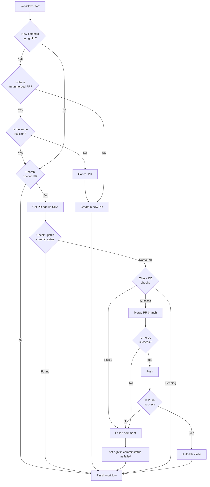

```mermaid
flowchart TB
W[Workflow Start] --> CommitCheck{New commits<br>in rightlib?}

CommitCheck -->|Yes| CheckExistingPR{Is there<br/>an unmerged PR?}
CheckExistingPR --> |Yes| CheckRevision{Is the same<br/>revision?}
CheckRevision --> |No| CancelPRCheck[Cancel PR] --> CreatePR
CheckRevision --> |Yes| CheckOpenedPR{Search<br/>opened PR}

CheckOpenedPR --> |Yes| GetPRRightlibHash[Get PR rightlib SHA]
CheckOpenedPR --> |No| Finish
GetPRRightlibHash --> CheckRightHashStatus{Check rightlib<br/>commit status}
CheckRightHashStatus --> |Not found| CheckPRChecks{Check PR<br/>checks}
CheckRightHashStatus --> |Found| Finish

CheckExistingPR --> |No| CreatePR[Create a new PR]
CreatePR --> Finish[Finish workflow]

CommitCheck -->|No| CheckOpenedPR

FailedComment --> MarkRefCommitAsFailed[set rightlib commit status as failed]

MarkRefCommitAsFailed --> Finish

CheckPRChecks --> |Failed| FailedComment[Failed comment]
CheckPRChecks --> |Pending| Finish
CheckPRChecks --> |Success| MergePR[Merge PR branch]
MergePR --> IsMergeSuccess{Is merge<br/>success?}
IsMergeSuccess --> |Yes| Push
Push --> IsPushSuccess{Is Push<br/>success}
IsPushSuccess --> |Yes| AutoPRClose[Auto PR close] --> Finish
IsPushSuccess --> |No| FailedComment
IsMergeSuccess --> |No| FailedComment
```
